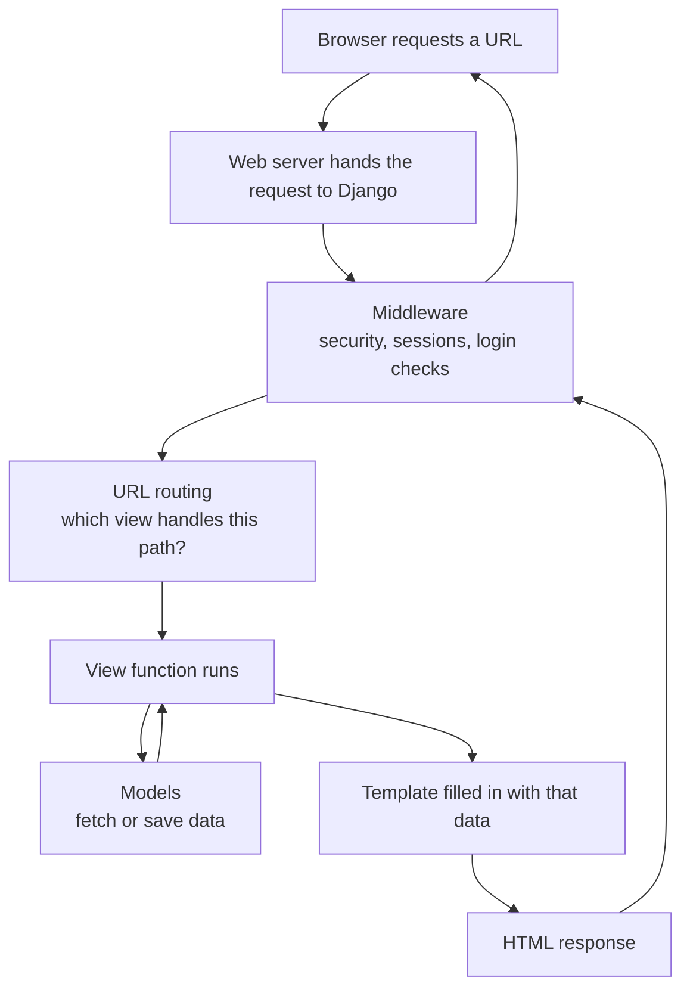

# How Django Works — A Concepts Guide

Written for developers who know Python but have never built a web application. It explains the pieces of Django and how they fit together. Examples are deliberately small and generic — the goal is the mental model, not a tour of any particular codebase.

---

## 1. What a Web Application Actually Is

If you have only written scripts, libraries, or data pipelines, one idea unlocks everything else:

**A web application is a program that turns a URL into a page of text.**

A browser sends a *request* ("give me `/playlists/`") and your program sends back a *response* (a string of HTML). The browser draws that string on the screen. That is the whole job.

A few facts that the rest of the guide assumes:

- **HTTP** is the format of that conversation. A request has a method (`GET` = "give me something", `POST` = "here is some data"), a path, and headers. A response has a status code (`200` OK, `404` not found) and a body.
- **HTML** is the text format of the page — plain text with tags describing structure.
- **CSS** styles it and **JavaScript** runs inside the browser. Django delivers those files but is otherwise not involved.
- **It's stateless.** Every request starts from scratch. The server remembers nothing about the last page unless you deliberately store it somewhere.
- **It's concurrent.** Many people hit the same code at the same time, so nothing can safely live in a module-level variable between requests.

Mental model: your web app is one big function, called once per click.

```python
def web_app(request) -> str:
    ...
    return "<html>...</html>"
```

Django's entire job is organizing the inside of that function.

---

## 2. Django in One Sentence

**Django receives HTTP requests, helps you fetch and validate data, and renders HTML back — with database access, security, forms, and admin tooling already written for you.**

"Framework" rather than "library" means Django calls *your* code. You never write a `main()` loop; you write functions and classes in the places Django expects and it runs them at the right moment. Same relationship `pytest` has with your test functions.

---

## 3. The Vocabulary: MTV

Django names its three layers Model, Template, and View. The naming trips up nearly everyone:

| Django name  | What it really is                            | Plain English |
| ------------ | -------------------------------------------- | ------------- |
| **Model**    | Python classes describing database tables    | the data      |
| **Template** | HTML files with placeholders                 | the page      |
| **View**     | A Python function that handles one request   | the logic     |

**In Django, the "view" is Python code and the "template" is the HTML.** If you have met MVC before, Django's "view" is what other frameworks call a controller.

The rule that keeps projects maintainable:

- Models know about data and nothing about the web.
- Views decide what data is needed and hand it off.
- Templates only display things — no business logic.

---

## 4. The Request Lifecycle

Every page load follows the same path. This is the diagram to internalize:



1. The browser asks for a path.
2. **Middleware** runs first — shared checks applied to every request, such as "is this user logged in?"
3. **Routing** matches the path against a list of patterns to pick one view.
4. **The view** runs. It is ordinary Python: gather data, decide what to show.
5. The view usually asks the **models** for data.
6. The view hands its data to a **template**, which produces HTML.
7. The response travels back out through the middleware to the browser.

One sentence to repeat until it sticks: **a view takes a request and returns a response.** Everything else is detail.

---

## 5. URLs — Choosing Which Code Runs

Routing is nothing more than a Python list mapping URL patterns to view functions:

```python
urlpatterns = [
    path("", views.home, name="home"),
    path("playlist/<int:playlist_id>/", views.playlist, name="playlist"),
]
```

Four ideas matter here:

- **Patterns are tried in order** until one matches. First match wins.
- **Parts of the URL become function arguments.** `<int:playlist_id>` matches only digits, converts them to a Python `int`, and passes the value to the view as a keyword argument. You never parse the URL string yourself.
- **Routes get names.** Naming a route means the rest of the codebase refers to it by name rather than by literal path, so changing the URL later updates every link automatically. Hardcoded URLs are a classic source of rot in web projects.
- **Each app owns its routes.** The project's URL list `include()`s each app's list, so an app stays self-contained and can be mounted under any prefix.

---

## 6. Views — Your Actual Logic

A view is a normal Python function with one rule:

```python
def some_page(request):
    ...
    return HttpResponse(...)
```

It receives a `request` object — the method, any submitted data, the logged-in user, cookies — and must return a response.

In practice you rarely build the response by hand. A `render()` shortcut covers the common case:

```python
return render(request, "myapp/page.html", {"items": items})
```

That third argument, a plain dict, is called the **context**, and it is the entire contract between Python and HTML. Keys in the dict become variable names inside the template. Nothing else crosses the boundary.

Two things worth saying out loud:

- **A view is just Python.** No magic in the body, easy to read, easy to test.
- **The template does not care where the data came from.** A list of dicts, database objects, or a third-party API response all render identically — so you can build a page before the database design is settled.

Django also offers **class-based views** and prewritten **generic views** for standard shapes (list page, detail page, create/edit form) that remove boilerplate once your pages become repetitive. Plain functions are the clearest starting point.

---

## 7. Templates — The HTML Side

A template is an HTML file with placeholders. Think f-strings, but deliberately restricted: the template language is *not* Python and cannot call arbitrary code. That restriction is the point — it keeps logic in views where it can be tested, and lets people who don't write Python edit pages safely.

Three constructs cover almost everything:

| Syntax                | Name     | Purpose                            |
| --------------------- | -------- | ---------------------------------- |
| `{{ value }}`         | variable | print something from the context   |
| ``           | tag      | loops, conditionals, structure     |
| `{{ value\|filter }}`  | filter   | format a value for display         |

### Template inheritance — the feature to show off

One template defines the page skeleton with named holes:

```django
<title></title>
<div id="content"></div>
```

Every other page extends it and fills in the holes:

```django

 ... 
```

One layout, many pages, no copy-pasted headers. Change the navigation once and the whole site updates. It is the templating equivalent of factoring shared behavior into a base class.

### Forgiving attribute lookup

`{{ thing.name }}` tries dictionary access, then attribute access, then list index. The same syntax works for dicts and objects, which is why swapping hardcoded data for real database objects usually requires no template changes at all.

### Escaping is automatic

Everything printed is HTML-escaped by default, so user-supplied text containing `<script>` renders as visible characters instead of executing. Protection against cross-site scripting is opt-out rather than opt-in — one of Django's most valuable defaults.

### Where templates live

Django looks in a project-level `templates/` folder and in each app's own `templates/` folder. Because all of those share one search space, files are nested one level deeper under the app's name (`templates/myapp/page.html`) so that two apps can both ship an `index.html` without colliding.

---

## 8. Models and the ORM — Talking to the Database

A model is a Python class describing a table:

```python
class Album(models.Model):
    title = models.CharField(max_length=200)
    artist = models.ForeignKey(Artist, on_delete=models.CASCADE)
    released = models.DateField()
```

The mapping is direct:

- **class → table**
- **attribute → column**
- **instance → row**

Field types do triple duty: each one is a database column type, a validation rule, *and* the input widget you get in forms and the admin. Constraints such as `unique=True` or `max_length` are declared right there instead of living in separate SQL files.

**Relationships are first class.** `ForeignKey` means "many of these belong to one of those." `ManyToManyField` means "many on both sides," and Django creates and manages the hidden join table for you. Django also adds an auto-incrementing `id` primary key unless you define your own.

### Queries without SQL

The ORM (Object-Relational Mapper) lets you query in Python and generates the SQL for you:

```python
Album.objects.all()
Album.objects.get(pk=1)
Album.objects.filter(artist__name="Dua Lipa").order_by("released")
Album.objects.filter(released__year=2024).count()
```

What a Python audience should take away:

- The double underscore (`artist__name`, `released__year`) is how you reach across a relationship or apply a comparison. It is the one genuinely unusual bit of syntax.
- Queries are **lazy** — nothing touches the database until you iterate the result, so you can build a query up in pieces.
- The ORM emits **parameterized queries**, which means SQL injection is prevented by default rather than by discipline.
- It is database-agnostic. Moving from SQLite to PostgreSQL is a settings change, not a rewrite.

Raw SQL is always available when you need it. The ORM is a convenience, not a cage.

---

## 9. Migrations — Version Control for Your Database

Editing a model class does not change the database. Two commands do:

```bash
python manage.py makemigrations   # compare models to the last known state, write a change file
python manage.py migrate          # apply pending change files to the database
```

Each migration is a generated, numbered Python file that lives in the repo beside your code.

Why this matters more than it sounds: schema changes become **reviewable in pull requests, reversible, applied in a guaranteed order, and reproducible on every machine and environment**. No hand-written `ALTER TABLE` scripts and no "did anyone remember to run the SQL on staging?"

---

## 10. Forms — Getting Data Back From Users

The hard part of accepting input is that everything arriving from a browser is an untrusted string. Django handles that from a single declaration:

```python
class SignupForm(forms.Form):
    email = forms.EmailField()
    age = forms.IntegerField(min_value=18)
```

From that one class you get:

- the **HTML inputs**, with appropriate types
- **validation on the server**, which is the part that actually counts
- **type conversion** — after `form.is_valid()`, the age is a real Python `int`, not a string
- **error messages** rendered next to the offending field automatically

The standard shape of a view that handles a form:

```python
if request.method == "POST":
    form = SignupForm(request.POST)
    if form.is_valid():
        ...                  # use the cleaned data, then redirect
else:
    form = SignupForm()      # empty form on the first visit
```

**`ModelForm`** goes further: point it at a model and Django builds the fields, the validation, and a `.save()` method for you — a working create/edit page in a few lines.

Two rules worth stating explicitly for a web-new audience:

- **Validation is layered.** The browser may check things first as a convenience, but only the server-side check is trustworthy. Anything coming from the client can be forged.
- **Submissions need a CSRF token.** Django rejects data submissions without one, which stops another site from posting to yours using a logged-in user's session.

---

## 11. The Admin Site — Django's Party Trick

Registering a model takes one line:

```python
admin.site.register(Album)
```

That produces a complete, permission-aware web interface for that data at `/admin/`: browsing, searching, filtering, paging, add/edit/delete forms, relationship pickers, and a change history per record.

Nothing else is written. Django reads the model definitions and builds the interface from them — the same declarations that create the database tables.

For an audience new to web work this is the moment that lands: a usable internal data-management tool that nobody had to build. Real projects lean on it constantly for staff and support users, and customize it gradually when the defaults aren't enough.

---

## 12. Static Files

**Static files** are the CSS, JavaScript, and images you ship with the app, as opposed to files users upload, which Django calls media.

You don't hardcode their paths either — a template tag resolves them:

```django

<link rel="stylesheet" href="">
```

During development Django serves these itself. For production, one command gathers every app's static files into a single folder for a web server or CDN, optionally adding a content hash to each filename so browsers pick up changes immediately. Templates don't change — only the resolved URL does.

Static files use the same app-name nesting as templates, for the same collision-avoidance reason.

---

## 13. How a Project Is Organized

**Project vs. app** is Django's unit of reuse:

- A **project** is the deployable whole: settings, the root URL list, the server entry point.
- An **app** is one self-contained feature, with its own models, views, templates, static files, and migrations. Apps are meant to be pluggable — Django's own admin and authentication are simply apps.

**`INSTALLED_APPS`** in the settings file is what switches an app on: its tables join the schema, its templates and static files become findable, its commands become available.

**Batteries included.** The default settings already give you, for free:

| Built-in app | What you get                                            |
| ------------ | ------------------------------------------------------- |
| admin        | the admin site                                          |
| auth         | users, groups, permissions, password hashing, login     |
| sessions     | remembering a user across requests                      |
| messages     | one-off notifications shown after an action             |
| staticfiles  | static file handling and bundling                       |

**Middleware** is a list of wrappers around every request — security headers, session loading, login checks, forged-submission protection. Cross-cutting concerns live here instead of being repeated in every view. Order matters, because each one wraps the next.

**`manage.py`** is the project's command line:

```bash
python manage.py runserver          # development server, auto-reloads on save
python manage.py makemigrations     # write migration files from model changes
python manage.py migrate            # apply them
python manage.py createsuperuser    # create an admin login
python manage.py shell              # Python REPL with the project loaded
python manage.py test               # run the test suite
```

`manage.py shell` is the best teaching tool in the box: an ordinary REPL where you can import models and run queries interactively.

---

## 14. Why Teams Pick Django

1. **Batteries included.** Authentication, admin, database layer, migrations, forms, sessions, caching, email, and security are all first-party and designed to work together — instead of a dozen separate packages you have to integrate and maintain yourself.
2. **Secure by default.** HTML escaping, forged-submission tokens, SQL injection prevention, clickjacking protection, and strong password hashing are on unless you turn them off.
3. **Write Python, not SQL** — and get a versioned, reversible schema history alongside it.
4. **The admin.** A genuinely useful internal tool generated from your models.
5. **Say things once.** Named URLs, template inheritance, and reusable apps mean one definition and one place to change it.
6. **Every project looks the same.** New team members know where things live on day one.
7. **Scales down and up.** The same framework runs a laptop demo and a high-traffic production site.
8. **Stable and well documented.** Long-term support releases, a clear deprecation policy, and a large ecosystem (REST APIs, background jobs, social login).
9. **Testing built in.** A test client simulates full requests against a throwaway database that is created and destroyed for you.

---

## 15. Glossary

| Term             | Meaning                                                             |
| ---------------- | ------------------------------------------------------------------- |
| **HTTP**         | The request/response message format browsers and servers use        |
| **Request**      | What the browser sends: a method, a path, and any submitted data     |
| **Response**     | What you send back: a status code and a body, usually HTML           |
| **Project**      | The deployable whole: settings, root URLs, entry point               |
| **App**          | A self-contained feature module inside a project                     |
| **URLconf**      | The list mapping URL patterns to views                               |
| **View**         | A function that takes a request and returns a response               |
| **Context**      | The dict of data a view hands to a template                          |
| **Template tag** | `` — logic and structure inside a template                  |
| **Filter**       | `{{ value\|filter }}` — formats a value for display                   |
| **Model**        | A Python class mapping to a database table                           |
| **ORM**          | Object-Relational Mapper — Python objects in place of SQL            |
| **QuerySet**     | A lazy, chainable collection of model objects                        |
| **Migration**    | A versioned, runnable description of a database schema change        |
| **Middleware**   | A wrapper that runs around every request and response                |
| **CSRF**         | A forged submission from another site; Django blocks it with a token |
| **MTV**          | Model–Template–View, Django's naming for MVC                         |

---

## 16. Where to Read More

- Official tutorial: <https://docs.djangoproject.com/en/stable/intro/tutorial01/>
- Topic guides (models, templates, forms, auth): <https://docs.djangoproject.com/en/stable/topics/>
- Deployment checklist: <https://docs.djangoproject.com/en/stable/howto/deployment/checklist/>
