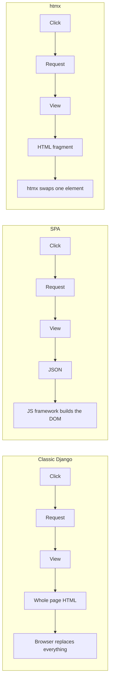

# How htmx Works — A Concepts Guide

A companion to [DJANGO_CONCEPTS.md](DJANGO_CONCEPTS.md), written for developers who know Python but have never done front-end work. It explains what problem htmx solves and how it changes the way you write Django views. Examples are small and generic on purpose.

---

## 1. The Problem: Whole Pages Are a Clumsy Unit

From the Django guide, the model of a web app is: browser asks for a URL, server sends back a complete HTML page, browser draws it.

That works, but every interaction costs you the entire page:

- Click "next page" of a table → the whole page is thrown away and rebuilt, including the header, sidebar, and everything else that didn't change.
- Submit a form with one bad field → full reload, the screen flashes white, your scroll position is lost.
- Want a search box that filters as you type? Impossible. Each keystroke would be a full page load.

The page is the only unit of exchange, and it is far too big.

Some vocabulary you need before the fix makes sense:

- **The DOM** is the browser's in-memory tree of the current page. HTML is the text that arrives; the DOM is the live object the browser renders and JavaScript can modify.
- **JavaScript** runs inside the browser and can change the DOM without a reload.
- **AJAX** is the umbrella term for JavaScript making an HTTP request in the background, without navigating away. This is what makes partial updates possible at all.

---

## 2. How the Industry Solved It (And What That Cost)

The dominant answer for the last decade was the **single-page application** (SPA), built with React, Vue, or Angular:

1. The server stops sending HTML and instead exposes a **JSON API**.
2. A large JavaScript application runs in the browser, fetches JSON, and builds the DOM itself.
3. All the rendering logic lives in the browser.

It solves the granularity problem, but the bill is steep for a small team:

- **You now have two applications** — a Python backend and a JavaScript frontend — with separate repos, builds, dependency trees, and test suites.
- **You have two sets of models.** The same "customer" concept exists as a Django model *and* as a TypeScript interface, and they drift apart.
- **You lose Django's best features.** Forms, template rendering, and the validation-error round trip are all replaced by hand-written JSON plumbing and client-side equivalents.
- **State lives in two places** and must be kept in sync, which is where most bugs come from.
- **A build toolchain** — bundlers, transpilers, package managers — that needs maintaining.

That's a rational trade for Figma or Gmail. It's a bad trade for a CRUD app with forms and tables, which is most internal software.

---

## 3. htmx in One Sentence

**htmx lets any element on the page make an HTTP request and replace part of the page with the HTML that comes back — using HTML attributes instead of JavaScript.**

The key move: **the server keeps sending HTML, just smaller pieces of it.** No JSON, no client-side rendering, no duplicated models.

It's one small JavaScript file (roughly 15 kB compressed) included with a single `<script>` tag. No build step, no npm, no compilation.



Notice that the htmx row and the Django row are the same until the last step. That is the whole point: **your views barely change.** They just return a smaller template.

---

## 4. The Four Questions

Every htmx interaction is an answer to four questions, and each one is an HTML attribute:

| Question | Attribute | Example |
| --- | --- | --- |
| What triggers the request? | `hx-trigger` | `click`, `keyup`, `every 2s` |
| Where does it go? | `hx-get` / `hx-post` / `hx-delete` … | `hx-get="/search/"` |
| What part of the page gets replaced? | `hx-target` | `hx-target="#results"` |
| How is it replaced? | `hx-swap` | `innerHTML`, `outerHTML`, `beforeend` |

A complete example:

```html
<button hx-get="/messages/" hx-target="#inbox" hx-swap="innerHTML">
  Check mail
</button>

<div id="inbox"></div>
```

Read it out loud: *when this button is clicked, GET `/messages/`, and put the returned HTML inside the element with id `inbox`.*

That's the entire mental model. Everything else in htmx is a refinement of those four questions.

Sensible defaults keep it short in practice: the trigger defaults to the natural event for the element (click for a button, submit for a form, change for an input), the target defaults to the element itself, and the swap defaults to `innerHTML`.

---

## 5. What the Server Sends Back

This is the part that matters most to a Python developer: **the response is an HTML fragment, not a JSON object and not a full page.**

A normal Django view returning a full page:

```python
def message_list(request):
    messages = Message.objects.all()
    return render(request, "app/messages_page.html", {"messages": messages})
```

The htmx version of the same view:

```python
def message_list(request):
    messages = Message.objects.all()
    return render(request, "app/_message_list.html", {"messages": messages})
```

The only difference is the template. `_message_list.html` contains just the list — no `<html>`, no `<head>`, no navigation:

```django
<ul>
  
    <li>{{ message.subject }}</li>
  
</ul>
```

These are usually called **partials**, and the leading underscore is a common convention for "this is a fragment, not a page."

Everything you already know still applies: the ORM, the context dictionary, template inheritance, escaping, authentication, the test client. htmx doesn't replace any of Django's layers — it just makes the response smaller.

### Serving both from one view

A common pattern is one URL that returns a full page for a normal visit and a fragment for an htmx request. htmx sets a request header (`HX-Request: true`) so the view can tell:

```python
def message_list(request):
    messages = Message.objects.all()
    template = "app/_message_list.html" if request.htmx else "app/messages_page.html"
    return render(request, template, {"messages": messages})
```

(`request.htmx` comes from the small `django-htmx` package; without it you'd check `request.headers.get("HX-Request")`.)

This means bookmarks, refreshes, and search engines still get a real page. The fragment is an optimization, not a requirement.

---

## 6. Targeting and Swapping

**`hx-target`** takes a CSS selector — the browser's query language for "which element." Common values:

| Value | Meaning |
| --- | --- |
| `#results` | the element with id `results` |
| `.card` | elements with class `card` |
| `this` | the element that made the request (the default) |
| `closest tr` | the nearest table row ancestor |
| `next .panel` | the next matching sibling |

**`hx-swap`** decides how the returned HTML is placed:

| Value | Effect |
| --- | --- |
| `innerHTML` | replace the contents of the target (default) |
| `outerHTML` | replace the target element itself |
| `beforeend` | append inside the target — how infinite scroll works |
| `afterbegin` | prepend inside the target |
| `delete` | remove the target, ignore the response |
| `none` | do nothing to the DOM |

`outerHTML` is worth understanding well: because the element replaces *itself*, the fragment you return can carry new htmx attributes, which is how a row turns into an edit form and then back into a row.

---

## 7. Triggers

**`hx-trigger`** covers far more than clicks, and its modifiers eliminate most of the JavaScript people used to write by hand:

```html
<input name="q"
       hx-get="/search/"
       hx-trigger="keyup changed delay:300ms"
       hx-target="#results">
```

That is a live search box. The modifiers mean: fire on keyup, but only if the value actually **changed**, and wait **300 ms** after typing stops before sending — so typing "django" sends one request rather than six. Writing that debounce by hand in JavaScript is a genuinely fiddly piece of code.

Other useful triggers:

- `every 2s` — polling, for dashboards or job status
- `load` — fire as soon as the element appears, for lazy-loading an expensive panel
- `revealed` — fire when scrolled into view, for infinite scroll
- `from:body` — listen for an event on a different element

---

## 8. The Patterns You'll Actually Build

Nearly every real feature is a combination of the above:

| Feature | How it's built |
| --- | --- |
| Live search | `keyup changed delay:300ms` → view filters a QuerySet → returns a results partial |
| Delete a row | `hx-delete` with `hx-target="closest tr"` and `hx-swap="outerHTML"`, returning empty content |
| Inline edit | Click swaps the row for a form partial; submitting swaps the form back for a row partial |
| Infinite scroll | Last item has `hx-trigger="revealed"` and `hx-swap="beforeend"` |
| Form validation | Post the form, return the same form partial with errors filled in |
| Auto-refresh | `hx-trigger="every 5s"` on a status element |
| Modal dialog | Load the dialog's contents into an empty container on demand |

The form validation row is the one to dwell on: it is exactly Django's normal form round trip, minus the full page reload. The view is nearly unchanged, and `form.errors` renders the same way it always did.

---

## 9. Useful Extras

A handful of attributes cover most remaining needs:

- **`hx-confirm="Are you sure?"`** — a confirmation dialog before the request.
- **`hx-indicator="#spinner"`** — an element to show while the request is in flight. htmx toggles a CSS class for you.
- **`hx-push-url="true"`** — update the address bar so the back button and bookmarks work even though there was no page load.
- **`hx-vals`** and **`hx-include`** — send extra values, or the contents of other inputs, along with the request.
- **`hx-boost="true"`** — placed on a container, this quietly upgrades all normal links and forms inside it to background requests that swap the body, giving you faster navigation with zero other changes.

The server can also drive the browser through **response headers**: `HX-Redirect` to navigate elsewhere, `HX-Trigger` to fire a client-side event (useful for showing a toast notification), `HX-Refresh` to force a full reload. This keeps control in your Python code instead of scattering it into scripts.

---

## 10. Django-Specific Glue

Three things you need to get right:

**1. CSRF tokens.** Django rejects data submissions without a valid token. The simplest fix is one attribute on the `<body>` tag in your base template, which applies to every htmx request on the page:

```django
<body hx-headers='{"X-CSRFToken": "{{ csrf_token }}"}'>
```

**2. Template organization.** Keep partials in their own folder or prefix them with an underscore so it's obvious which templates are fragments. A partial should render correctly on its own, with no assumptions about surrounding markup.

**3. Error responses.** htmx only swaps content for successful responses by default. For form validation errors, return the re-rendered form partial with a normal `200` status — the errors are a valid outcome, not a failure. Reserve `4xx`/`5xx` for genuine problems.

The optional `django-htmx` package adds `request.htmx` and a few response helpers. It's a convenience, not a dependency you need to start.

---

## 11. What htmx Does *Not* Do

Being clear about the limits keeps expectations honest:

- **It doesn't manage client-side state.** There's no store, no reactivity, no component model. The server is the source of truth, and if a value must survive without a round trip, htmx isn't the tool.
- **It doesn't do rich client-only interactions.** Drag-and-drop canvases, spreadsheets, text editors, and games still need real JavaScript. Small pieces of local behavior (dropdown toggles, tabs) usually pair with a tiny library like Alpine.js.
- **It doesn't work offline** and it doesn't help you build a mobile app that needs a JSON API. If you need the API anyway, some of htmx's savings disappear.
- **It's chattier with the server.** Every interaction is a request. On a fast internal network that's invisible; over poor mobile connections it's a real consideration.

The rule of thumb: if the interaction can afford a server round trip, htmx is likely the simpler answer. If it can't, use JavaScript for that piece.

---

## 12. Why Teams Pick htmx

1. **One application, one language.** Rendering logic stays in Django templates. No second codebase, no duplicated models, no build toolchain.
2. **Your existing skills transfer directly.** Views, templates, the ORM, forms, and auth all work unchanged — you are writing the same Django you already write.
3. **The server stays the source of truth.** Whole categories of state-synchronization bugs never come up.
4. **It's readable in the markup.** Looking at an element tells you what it does; you don't have to trace an event handler through a JavaScript bundle.
5. **It degrades gracefully.** With a full-page fallback, the app still works for crawlers, and links remain real links.
6. **It's small and stable.** One file, no dependencies, no ecosystem churn to keep up with.
7. **Less code overall.** Features that would be several hundred lines of JavaScript are often a handful of attributes plus a partial template.

The underlying idea has a name — **hypermedia** — and it's the original design of the web: the server sends content that includes the available actions, rather than raw data that a client must know how to interpret. htmx's argument is that the web already had a good architecture, and it was abandoned prematurely because HTML lacked a few capabilities. htmx adds those capabilities.

---

## 13. Glossary

| Term | Meaning |
| --- | --- |
| **DOM** | The browser's live, in-memory tree representing the current page |
| **AJAX** | A background HTTP request made without navigating to a new page |
| **SPA** | Single-page application — a JavaScript app that renders in the browser from JSON |
| **JSON API** | A server that returns raw data instead of HTML |
| **Fragment / partial** | A small piece of HTML that isn't a complete page |
| **Swap** | Replacing part of the DOM with returned HTML |
| **Target** | The element that gets replaced |
| **Trigger** | The event that causes the request |
| **CSS selector** | The syntax for identifying elements, e.g. `#results`, `.card` |
| **Debounce** | Waiting for activity to stop before acting, so rapid input sends one request |
| **Polling** | Repeatedly asking the server for updates on a timer |
| **Progressive enhancement** | Building something that works plainly, then layering improvements on top |
| **Hypermedia** | Content that carries its own available actions — the web's original design |

---

## 14. Where to Read More

- htmx documentation: <https://htmx.org/docs/>
- Attribute reference: <https://htmx.org/reference/>
- Examples with working code: <https://htmx.org/examples/>
- *Hypermedia Systems*, free online book by htmx's authors: <https://hypermedia.systems/>
- `django-htmx` documentation: <https://django-htmx.readthedocs.io/>
